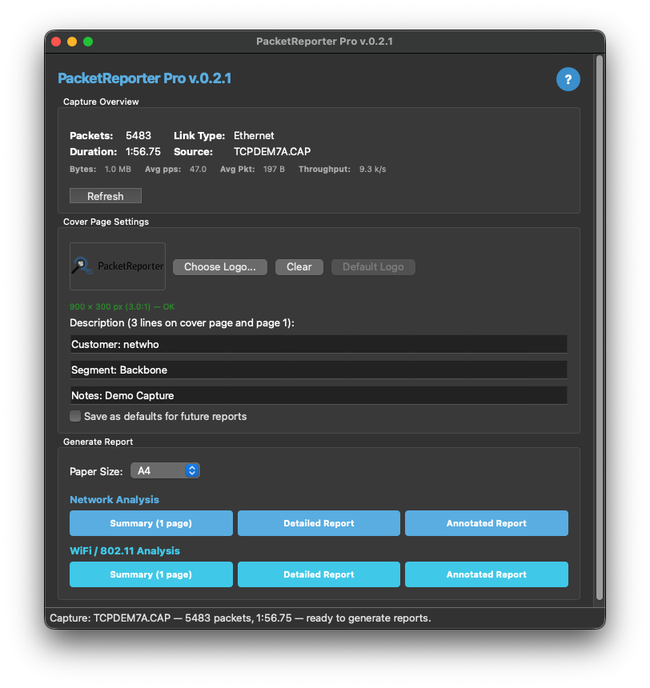
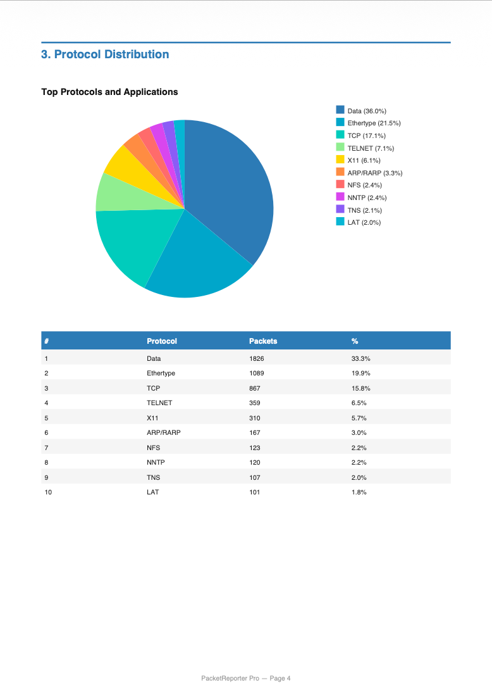
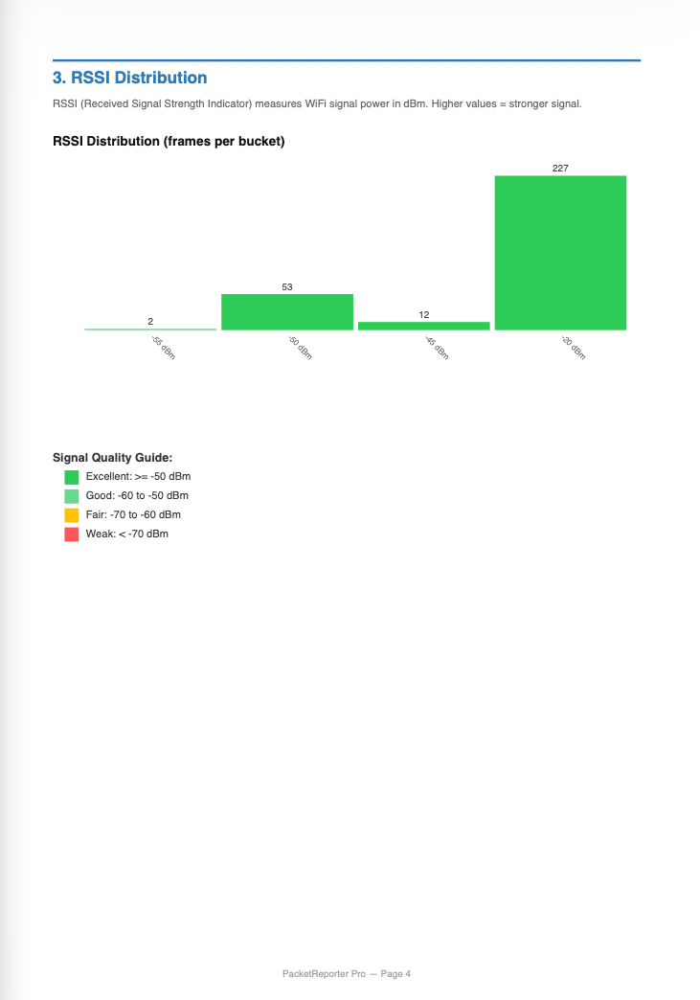

# PacketReporter Pro

[](https://www.wireshark.org/)
[](https://www.wireshark.org/)
[](https://www.wireshark.org/)
[](#)
[-blue?logo=apple&logoColor=white)](#)
[](#license)
[](#)
[](#)

A native Wireshark plugin that generates professional PDF reports directly from packet captures — **no external tools required**.

PacketReporter Pro is a compiled C/C++ Wireshark plugin using **libcairo** for high-quality vector PDF rendering and **Qt6** for an integrated settings window. It replaces the original Lua-based [PacketReporter](https://github.com/netwho/PacketReporter) with dramatically better performance, richer reports, and zero runtime dependencies beyond Wireshark itself.

## Why Native?

PacketReporter Pro is derived from the Lua-based [PacketReporter](https://github.com/netwho/PacketReporter) plugin. While the Lua version gets the job done, its reliance on external tools for PDF generation (rsvg-convert, pdfunite) became a real pain point — particularly on Windows, where Lua would open a terminal window for *every single page* of the report being created. Lua simply isn't the right approach for this type of plugin.

That said, Lua is perfect for adding decode modules or modifying dissectors where you want zero dependencies — as demonstrated by [PacketSanitizer](https://github.com/netwho/PacketSanitizer). No compilation, no version coupling, no problem.

**What PacketReporter Pro does differently:**

- **Performance** — native compiled C code instead of interpreted Lua
- **Integrated UI** — a Qt6 settings window where you select paper size (A4 / Legal), configure a custom logo and cover page text, and choose from different report types:
  - *Network Analysis:* Summary, Detailed, and Annotated Report
  - *WiFi / 802.11 Analysis:* Summary, Detailed, and Annotated Report
  - More to come

## Considerations

While the native plugin is the primary focus going forward, there are trade-offs:

- **Version-dependent** — the plugin must be recompiled for each major Wireshark release (currently shipping binaries for 4.2, 4.4, and 4.6)
- **QA scope** — testing has been limited to macOS 26 (Tahoe), Ubuntu 24, and Windows 11. The biggest challenge was surprisingly Linux, where certain Wireshark API differences between versions could crash Wireshark during report generation — resolved in v0.1.1

<!-- Screenshots – see examples/ for full-resolution versions -->
<p align="center">
  
  &nbsp;&nbsp;
  
</p>
<p align="center">
  
  &nbsp;&nbsp;
  
</p>

## Features

- **Network Summary** — one-page network stats, protocol pie chart, top talkers
- **Network Detailed Report** — 12+ page PDF with 12 analysis sections (PCAP summary, IP stats, protocols, communication matrix, port analysis, protocol hierarchy, DNS, TLS/SSL, HTTP, MAC layer, IP layer, TCP analysis)
- **Network Annotated Report** — same content as Detailed, with a 60/40 layout adding expert annotation sidebars that explain each section for non-experts
- **WiFi Summary** — one-page WiFi overview (BSSIDs, clients, channels, RSSI, retry rate)
- **WiFi Detailed Report** — 10+ page 802.11 analysis (RSSI, SNR, channels, MCS, frame types, deauth, retry, airtime)
- **WiFi Annotated Report** — WiFi Detailed with annotation sidebars for each WiFi metric
- **Cover page** with custom logo and description lines
- **Paper size** choice (A4 / US Legal)
- **Dark / light theme** aware UI — adapts to Wireshark's theme automatically
- **Built-in help** with monitor-mode instructions and report descriptions
- **Zero external dependencies** at runtime — no rsvg-convert, pdfunite, Inkscape, etc.

## Quick Start

### macOS

```bash
cd installers/macos
./install.sh
# Restart Wireshark → Tools → PacketReporter Pro
```

The installer ships a **universal binary** (arm64 + x86\_64) with Cairo statically linked — nothing else to install.

### Linux

```bash
cd installers/linux
./install.sh
# Auto-detects Wireshark version (4.2 / 4.4 / 4.6) and installs the matching .so
```

### Windows

```powershell
cd installers\windows
.\install.bat
```

### Build from source (any platform)

```bash
# macOS
cd build/macos && ./setup_mac_build.sh && ./build_plugin.sh

# Linux
cd build/linux && ./setup_linux_build.sh && ./build_plugin.sh

# Linux via Docker (all Wireshark versions)
cd docker && ./build_all.sh

# Windows (PowerShell)
cd build\windows
.\setup_windows_build.ps1
.\build_plugin.ps1
```

## Usage

1. Open a capture file in Wireshark
2. Go to **Tools → PacketReporter Pro**
3. Click **Refresh** to load capture overview
4. Customize the cover page (logo, description lines) and select paper size
5. Click a report button — the PDF opens automatically

> **WiFi reports** require a capture in **monitor mode** (rfmon). In monitor mode the WiFi adapter captures all 802.11 frames over the air — management, control, and data — from all nearby networks. See the built-in help **?** for setup instructions per platform.

## Report Types

| Report | Capture Type | Pages | Content |
|--------|-------------|-------|---------|
| **Network Summary** | Network | 1 | Packet/byte counts, protocol distribution, top IP addresses |
| **Network Detailed** | Network | 14+ | Cover page, ToC, 12 analysis sections, summary page |
| **Network Annotated** | Network | 14+ | Detailed report with expert annotation sidebars (60/40 layout) |
| **WiFi Summary** | 802.11 (monitor) | 1 | BSSIDs, clients, channels, RSSI, retry rate, channel pie chart |
| **WiFi Detailed** | 802.11 (monitor) | 10+ | 10 sections: RSSI, SNR, channels, MCS, frames, deauth, retry, airtime |
| **WiFi Annotated** | 802.11 (monitor) | 12+ | WiFi Detailed with annotation sidebars for each metric |

## Screenshots

> **TODO**: Add screenshots to `examples/` — the following are planned:
>
> | File | Description |
> |------|-------------|
> | `screenshot-main-window.png` | Main window (dark + light theme) |
> | `screenshot-executive-report.png` | Executive Summary PDF output |
> | `screenshot-detailed-report.png` | Detailed Report cover + sample pages |
> | `screenshot-wifi-report.png` | WiFi Detailed Report sample pages |
> | `screenshot-help-dialog.png` | Built-in help dialog |

## Project Structure

```
PacketReporter-Pro/
├── README.md
├── LICENSE
│
├── src/                              # Plugin source code (C/C++)
│   ├── CMakeLists.txt                # Build config (epan + Qt6 + Cairo)
│   ├── reporter_plugin.c/.h          # Plugin entry point, menu registration
│   ├── pro_window.cpp/.h             # Qt main window (theme-aware)
│   ├── ui_bridge.cpp/.h              # C ↔ C++ bridge
│   ├── packet_collector.c/.h         # Network data collection
│   ├── wifi_collector.c/.h           # WiFi / 802.11 data collection
│   ├── report_renderer.c/.h          # Cairo charts, tables, diagrams
│   ├── pdf_export.c/.h               # PDF report generation
│   └── config_reader.c/.h            # Config persistence
│
├── build/                            # Platform build scripts
│   ├── macos/                        # setup + build scripts
│   ├── linux/                        # setup + build scripts
│   └── windows/                      # setup + build scripts (PowerShell)
│
├── docker/                           # Docker builds (Linux, multi-version)
│   ├── build_all.sh                  # Build WS 4.2 + 4.4 + 4.6
│   ├── ws42/Dockerfile
│   ├── ws44/Dockerfile
│   └── ws46/Dockerfile
│
├── installers/
│   ├── macos/                        # Installer + universal binary (.so)
│   │   ├── install.sh
│   │   └── packetreporterpro.so      # arm64 + x86_64, static Cairo
│   ├── linux/                        # Installer + per-version binaries
│   │   ├── install.sh
│   │   ├── packetreporterpro-ws42.so
│   │   ├── packetreporterpro-ws44.so
│   │   └── packetreporterpro-ws46.so
│   └── windows/                      # Installer + DLL
│       ├── install.ps1
│       ├── install.bat
│       └── packetreporterpro.dll
│
├── sample-data/                      # Default logo + config
│   ├── Logo.png
│   └── packet_reporter.txt
│
└── examples/                         # Screenshots and sample reports
```

## Build Dependencies

| Dependency | Purpose | macOS | Linux (apt) | Windows |
|-----------|---------|-------|-------------|---------|
| Wireshark 4.2–4.6 | Plugin host + headers | source clone | source clone / Docker | source clone |
| CMake ≥ 3.16 | Build system | `brew install cmake` | `apt install cmake` | VS installer |
| Qt6 | Settings window UI | `brew install qt@6` | `apt install qt6-base-dev` | qt.io installer |
| Cairo | PDF rendering | `brew install cairo` | `apt install libcairo2-dev` | vcpkg |
| GLib 2.x | Data structures | `brew install glib` | `apt install libglib2.0-dev` | vcpkg |

> **End users** need only Wireshark installed. The macOS binary has Cairo statically linked, and Linux/Windows Wireshark packages include all required shared libraries.

## macOS Build Notes

The macOS binary is a **universal binary** (arm64 + x86\_64) with Cairo and its dependencies (pixman, libpng, freetype, fontconfig) **statically linked**:

- Zero Homebrew or third-party library requirements on the target machine
- Works on both Apple Silicon and Intel Macs
- Only depends on Wireshark.app's bundled frameworks + macOS system libraries

## Wireshark API Compatibility

The plugin supports Wireshark 4.2 through 4.6 using compile-time API shims:

```c
#if VERSION_MINOR >= 6
    // Wireshark 4.6+ API (embedded buffer in wtap_rec)
#else
    // Wireshark 4.2/4.4 API (separate Buffer + tvbuff_t)
#endif
```

## Migrating from the Lua Plugin

| Feature | Lua Plugin | PacketReporter Pro |
|---------|-----------|-------------------|
| PDF generation | Requires rsvg-convert + pdfunite | Built-in (Cairo) |
| Report quality | SVG → PNG → PDF pipeline | Direct vector PDF |
| WiFi reports | Basic | Full 10-section analysis + annotated |
| Annotated reports | None | Expert sidebars explaining each section |
| Settings UI | None | Integrated Qt6 window |
| Performance | Interpreted | Compiled C/C++ |
| Theme support | None | Dark / light auto-detect |

Both plugins can coexist. Your existing `~/.packet_reporter/` config is preserved.

## Troubleshooting

### Plugin not showing in Wireshark

1. Restart Wireshark completely
2. Check **Help → About Wireshark → Plugins** for `packetreporterpro`
3. Verify the `.so` / `.dll` is in the correct versioned plugin directory (e.g. `4-6/epan/`)

### macOS: "code signature invalid"

```bash
xattr -cr ~/.local/lib/wireshark/plugins/packetreporterpro.so
```

### WiFi reports show no data

The capture must be in **monitor mode**. A regular WiFi capture (managed mode) does not contain radiotap headers or 802.11 management frames.

### Windows: "The specified module could not be found"

Verify `C:\Program Files\Wireshark\libcairo-2.dll` exists. The standard Wireshark installer bundles it.

## Credits

**Author & Architect:** Walter Hofstetter

**AI-Assisted:** Yes (Claude) — build system automation, installer scripting, cross-platform compatibility, and documentation.

## License

This plugin follows Wireshark's GPL-2.0 license. See [LICENSE](LICENSE) for details.

---

<p align="center">
Built with ❤️ for the network analysis community — <a href="https://github.com/netwho/PacketReporter-Pro">github.com/netwho/PacketReporter-Pro</a>
</p>
